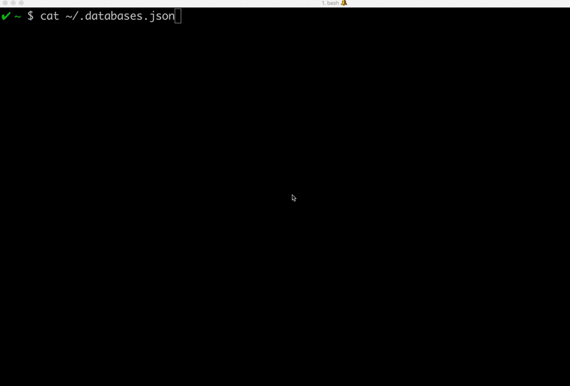

# sql [](https://travis-ci.org/marianogappa/parseq) [](https://raw.githubusercontent.com/MarianoGappa/sd/master/LICENSE)

MySQL pipe



[Blogpost](https://movio.co/en/blog/improving-with-sql-and-charts/)

## What does it do?

- `sql` allows you to pipe STDIN (hopefully containing SQL) to one or more pre-configured MySQL or PostgreSQL databases
- output comes out in `\t`-separated format, allowing further piping (e.g. works really well with [chart](https://github.com/MarianoGappa/chart))
- when more than one database is queried, the requests are made in parallel
- `sql` can either run `mysql/psql` locally, run `mysql/psql` locally but connecting to a remote host (by configuring a `dbServer`), or `ssh` to a remote host and from there run `mysql/psql` to either a local or remote host (by configuring an `appServer` and a `dbServer`)

## Installation

Get the latest binary on the [Releases](https://github.com/MarianoGappa/sql/releases) section, or via `go get`:
```
go get -u github.com/marianogappa/sql
```

### Auto completion

Optionaly, you can install auto complete scripts for your shell too. It will complete the name of databases.

For bash, copy or link `sql-bash-autocomplete` file to `/etc/bash_completion.d` directory.

For zsh, copy or link `sql-zsh-autocomplete` file to somewhere in your `$fpath`. (If you use oh-my-zsh framework, copy/link it to `~/.oh-my-zsh/completions`.) Note that file should be renamed to `_sql`. You may also need to run the following commands in order to force ZSH to rebuild its auto completion cache.

```
$ rm ~/.zcompdump
$ compinit
```

## Configuration

Create a `.databases.json` dotfile in your home folder or in any [XDG-compliant](https://standards.freedesktop.org/basedir-spec/basedir-spec-latest.html) directory. [This](.databases.json.example) is an example file.

`sql` decides to execute with MySQL or PostgreSQL depending on the `sqlType` property set for a database, *defaulting to to MySQL if not set.*

## Example usages

```
cat query.sql | sql test_db

sed 's/2015/2016/g' query_for_2015.sql | sql db1 db2 db3

sql all "SELECT * FROM users WHERE name = 'John'"
```

## Notes

- when more than one database is queried, the resulting rows are prefixed with the database identifier
- the `all` special keyword means "sql to all configured databases".
- `sql` assumes that you have correctly configured SSH keys on all servers you `ssh` to
- `sql` will error if all targeted databases do not have the same sql type.

## Beware!

- please note that `~/.databases.json` will contain your database credentials in plain text; if this is a problem for you, don't use `sql`!
- `sql` is meant for automation of one-time lightweight ad-hoc `SELECT`s on many databases at once; it's not recommended for mission critical bash scripts that do destructive operations on production servers!
- If you close an ongoing `sql` operation, spawned `mysql` and `ssh`->`mysql` processes will soon follow to their deaths, but the underlying mysql server query thread will complete, as long as it takes! https://github.com/marianogappa/sql/issues/7

## Dependencies

- mysql-client and/or postgresql-client
- ssh (only if you configure an "appServer")

## Contribute

If you have an issue with sql, I'd love to [hear about it](https://github.com/marianogappa/sql/issues/new). PRs are welcome. Ping me on [Twitter](https://twitter.com/MarianoGappa) if you want to have a chat about it.
